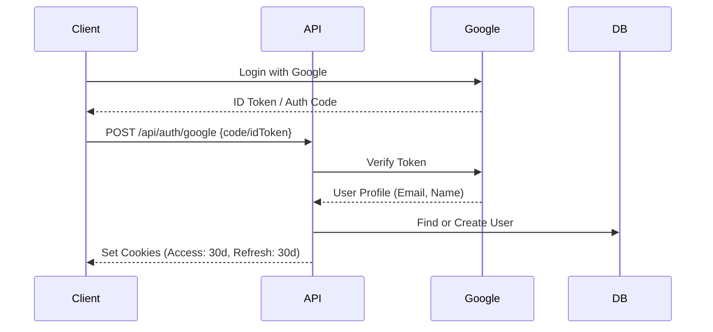
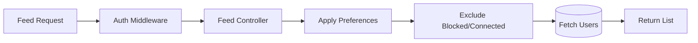
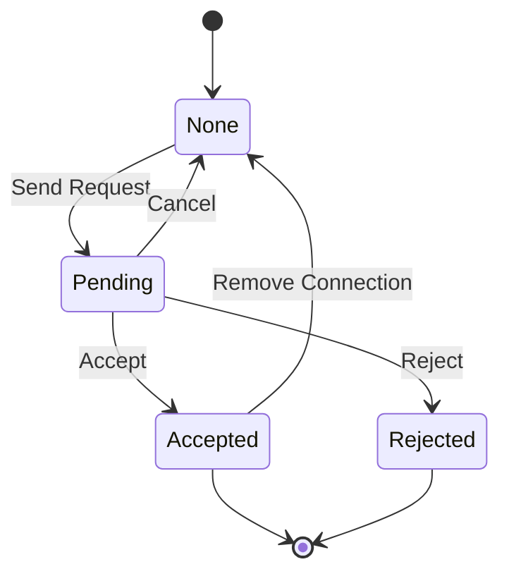
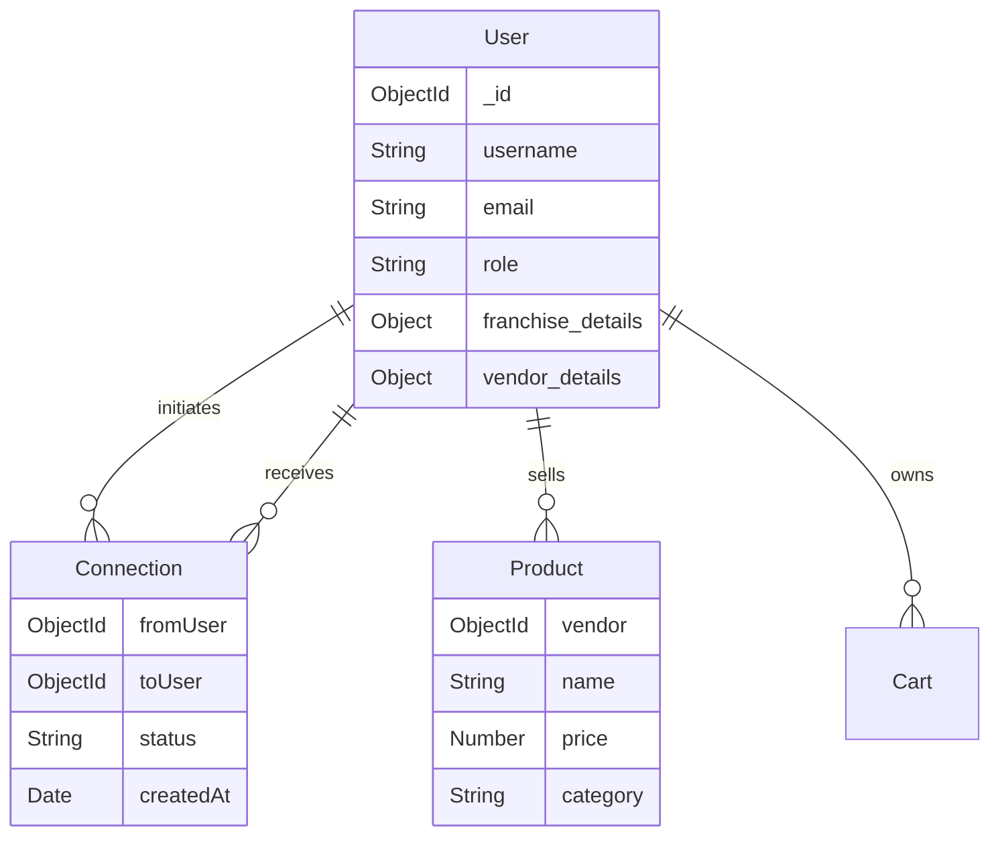

# WeddingZon System Design

## 1. High-Level Architecture

WeddingZon uses a microservice-ready modular monolith architecture. The frontend is built with Next.js (hosted on AWS Amplify), while the backend is an Express.js application (hosted on AWS EC2), connecting to MongoDB Atlas and AWS S3.

```mermaid
graph TD
    User[User (Browser/Mobile)] -->|HTTPS| CloudFront[AWS CloudFront]
    CloudFront -->|Frontend Assets| Amplify[AWS Amplify (Next.js)]
    CloudFront -->|API Requests| ALB[Application Load Balancer / Nginx]
    
    subgraph "Backend Infrastructure (EC2)"
        ALB -->|Reverse Proxy| NodeApp[Node.js + Express Server]
        NodeApp -->|Auth| GoogleAuth[Google OAuth]
        NodeApp -->|Storage| S3[AWS S3 (Images)]
        NodeApp -->|Database| MongoDB[(MongoDB Atlas)]
        NodeApp -->|Real-time| SocketIO[Socket.io Server]
    end

    subgraph "Admin Infrastructure"
        AdminUser[Admin User] -->|HTTPS| AdminPortal[Admin Portal (Next.js)]
        AdminPortal -->|API Requests| ALB
    end
```

## 2. Technology Stack

### Frontend (User & Admin)
- **Framework**: Next.js 16.1.1 (React 19)
- **Language**: TypeScript / JavaScript
- **Styling**: TailwindCSS
- **State Management**: React Context (Cart, Auth)
- **Deployment**: AWS Amplify

### Backend
- **Runtime**: Node.js
- **Framework**: Express.js
- **Database**: MongoDB (Mongoose ODM)
- **Real-time**: Socket.io
- **Storage**: AWS S3 (via `@aws-sdk/client-s3`)
- **Authentication**: JWT (Access/Refresh Tokens) + Google OAuth
- **Deployment**: AWS EC2 (PM2 + Nginx)

## 3. Module Design

### 3.1 Authentication Module
Handles user login via Google and traditional credentials, session management via JWT.

**Key APIs:**
- `POST /api/auth/google`: Exchange ID token/code for JWT.
- `POST /api/auth/refresh`: Rotate access tokens.



### 3.2 User Profile & Feed Module
Manages user profiles, preferences, and the matchmaking feed.

**Key APIs:**
- `GET /api/users/feed`: Smart algorithm to fetch potential matches.
- `GET /api/users/:username`: fetch profile details.
- `POST /api/users/upload-photos`: S3 integration.



### 3.3 Connection Module
Handles the state machine of user relationships (Pending, Accepted, Rejected).



### 3.4 Franchise Module
Allows franchise owners to manage profiles on behalf of users.

**Workflow:**
1. Franchise registers and gets approved by Admin.
2. Franchise creates sub-profiles (`created_for: franchise`).
3. Franchise manages photos and preferences for these profiles.

### 3.5 E-Commerce (Shop) Module
Users can buy wedding-related products from vendors.

## 4. Database Schema (Simplified)



## 5. Deployment & Configuration

**Nginx Configuration (Crucial for Images)**:
To support large image uploads, the Nginx reverse proxy must be configured:

```nginx
server {
    listen 80;
    server_name api.weddingzon.com;

    client_max_body_size 100M; # FIX 413 Error

    location / {
        proxy_pass http://localhost:5000;
        proxy_http_version 1.1;
        proxy_set_header Upgrade $http_upgrade;
        proxy_set_header Connection 'upgrade';
        proxy_set_header Host $host;
        proxy_cache_bypass $http_upgrade;
    }
}
```
